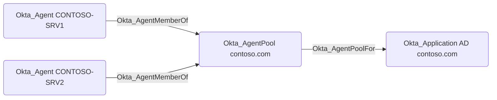

# Okta_AgentPoolFor

## Edge Schema

- Source: [Okta_AgentPool](../NodeDescriptions/Okta_AgentPool.md)
- Destination: [Okta_Application](../NodeDescriptions/Okta_Application.md)

## General Information

`Okta_AgentPoolFor` edges connect an AD `Okta_AgentPool` to the backing `Okta_Application` used for directory integration.

