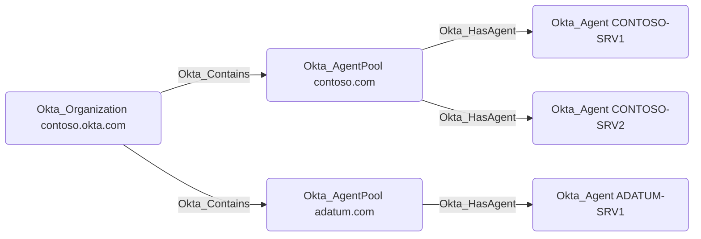

## General Information

`Okta_AgentPool` nodes are connected to their constituent `Okta_Agent` nodes via `Okta_HasAgent` edges. Active Directory Agent Pools and their agents can be visualized in BloodHound as follows:

> [!WARNING]
> Traversable edges between the `Okta_AgentPool` and AD `Domain` nodes are not created in the current version of `OktaHound`.
> This functionality is planned for a future release.
