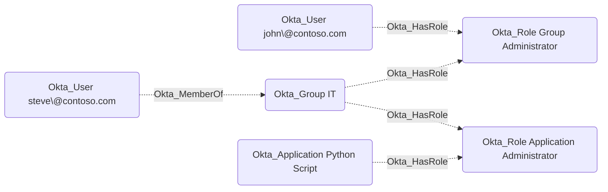

# Okta_HasRole

## Edge Schema

- Source: [Okta_User](../NodeDescriptions/Okta_User.md), [Okta_Group](../NodeDescriptions/Okta_Group.md), [Okta_Application](../NodeDescriptions/Okta_Application.md)
- Destination: [Okta_Role](../NodeDescriptions/Okta_Role.md), [Okta_CustomRole](../NodeDescriptions/Okta_CustomRole.md)

## General Information

The non-traversable `Okta_HasRole` edges represent the role assignments for users in Okta:

