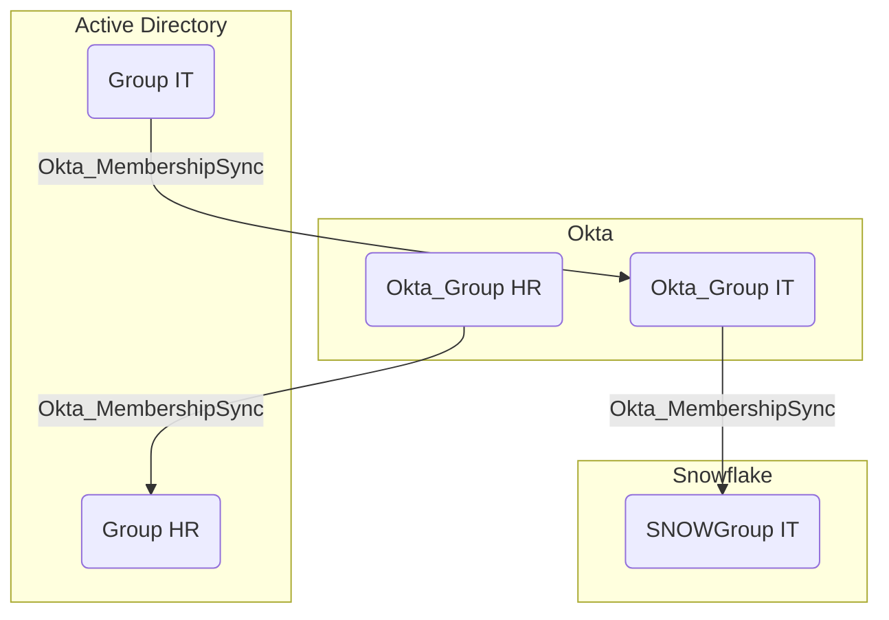

## General Information

The traversable hybrid `Okta_MembershipSync` edges represent the synchronization relationships between groups in external directories and their corresponding groups in Okta:

