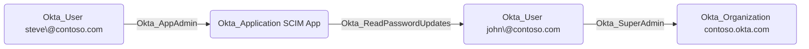

# Okta_ReadPasswordUpdates

## Edge Schema

- Source: [Okta_Application](../NodeDescriptions/Okta_Application.md)
- Destination: [Okta_User](../NodeDescriptions/Okta_User.md)

## General Information

The traversable `Okta_ReadPasswordUpdates` edges represent applications that can read password updates over SCIM.

