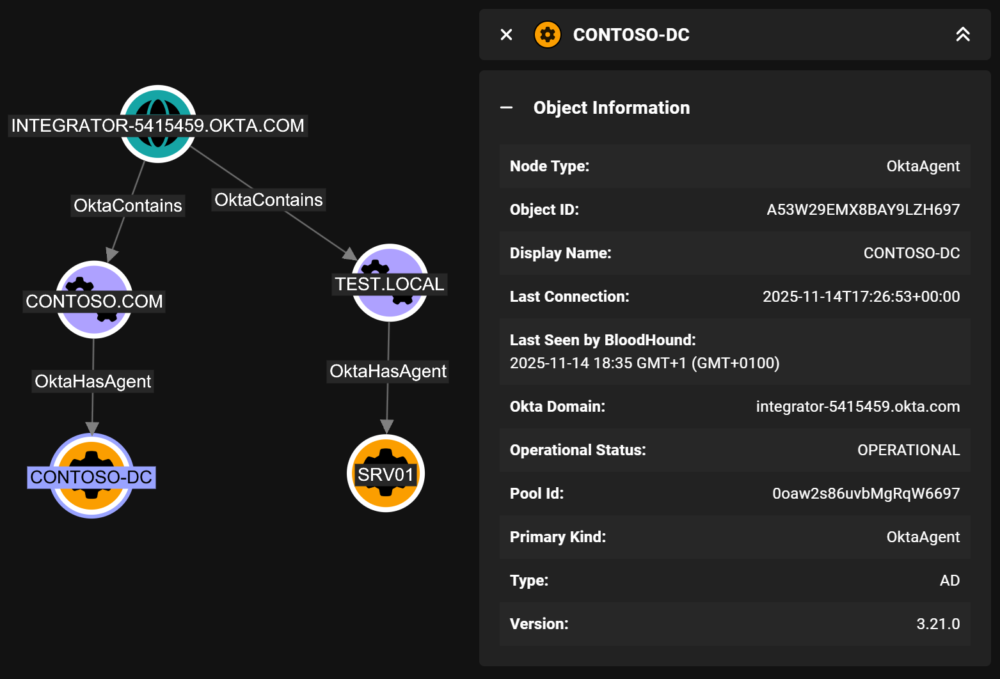

# Okta_Agent

## Overview

The `Okta_Agent` node represents an Okta Agent, which is a component used in Okta's integration with on-premises systems.
Okta Agents facilitate communication between the Okta cloud and on-premises applications or directories, enabling features such as single sign-on (SSO) and user provisioning.

One or more agents are grouped into Agent Pools, represented by the [Okta_AgentPool](Okta_AgentPool.md) nodes, to provide redundancy and load balancing.



## Properties

| Name | Source | Type | Description |
| ---- | ------ | ---- | ----------- |
| `id` | `agent.id` | `string` | Unique agent identifier. |
| `name` | `agent.name` | `string` | Agent name shown in Okta Admin Console. |
| `displayName` | `agent.name` | `string` | Display label used in BloodHound. |
| `oktaDomain` | Collector context (non-API) | `string` | Okta organization domain where the agent exists. |
| `poolName` | `agentPool.name` | `string` | Name of the parent [Okta_AgentPool](Okta_AgentPool.md). For AD pools this typically corresponds to the synced AD domain. |
| `operationalStatus` | `agent.operationalStatus` | `string` | Runtime health/operational state reported by Okta. |
| `updateStatus` | `agent.updateStatus` | `string` | Agent software update state. |
| `type` | `agent.type` | `string` | Agent type (for example AD, LDAP, IWA, or RADIUS). |
| `version` | `agent.version` | `string` | Agent software version. |
| `poolId` | `agent.poolId` | `string` | Identifier of the parent Okta agent pool. |
| `lastConnection` | `FromUnixTime(agent.lastConnection)` | `datetime` | Timestamp of the last successful agent connection to Okta. |

## Sample Property Values

```yaml
id: a53xfufl4rqWcHhQo697
name: LON-SRV01
displayName: LON-SRV01
poolId: 0oaxg9rhdd7ncGCXv697
oktaDomain: contoso.okta.com
poolName: contoso.local
operationalStatus: DISRUPTED
updateStatus: Cancelled
type: AD
version: 3.22.0
lastConnection: 2026-01-15T02:29:40+00:00
```
