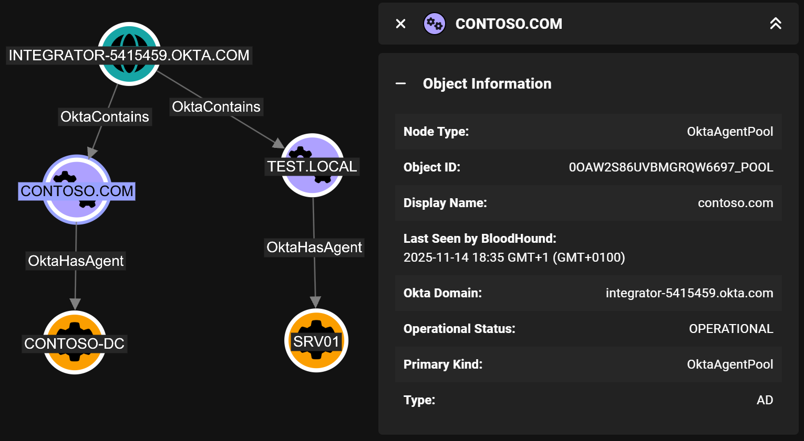

# Okta_AgentPool

## Overview

The `Okta_AgentPool` nodes represent Okta Agent Pools, which are collections of Okta Agents (represented as [Okta_Agent](Okta_Agent.md) nodes) that work together to provide high availability and load balancing for on-premises integrations.

The following agent pool types are supported by Okta:

| Agent Pool Type | Description |
|-----------------|-------------|
| AD              | [Active Directory](https://help.okta.com/en-us/content/topics/directory/ad-agent-integration-implementation-options.htm) |
| IWA             | [Integrated Windows Authentication (Kerberos/NTLM)](https://help.okta.com/en-us/content/topics/directory/ad-iwa-learn.htm) |
| LDAP            | [Lightweight Directory Access Protocol](https://help.okta.com/en-us/content/topics/directory/ldap-agent-supported-directories.htm) |
| RADIUS          | [RADIUS authentication proxy](https://help.okta.com/en-us/content/topics/integrations/radius-best-pract-flow.htm) |
| MFA             |  |
| OPP             |  |
| RUM             |  |

The most common agent pool type is the Active Directory (AD) Agent Pool, which consists of one or more AD Agents that facilitate bi-directional object synchronization between Okta and on-premises Active Directory environments.



## Properties

| Name | Source | Type | Description |
| ---- | ------ | ---- | ----------- |
| `id` | `agentPool.id + "_pool"` | `string` | Unique agent pool identifier. |
| `name` | `agentPool.name` | `string` | Name of the Okta agent pool. |
| `displayName` | `agentPool.name` | `string` | Display label used in BloodHound. |
| `oktaDomain` | Collector context (non-API) | `string` | Okta organization domain where the agent pool exists. |
| `operationalStatus` | `agentPool.operationalStatus` | `string` | Current health/operational state of the agent pool. |
| `type` | `agentPool.type` | `string` | Agent pool type (for example AD, LDAP, IWA, RADIUS). |

> [!NOTE]
> Active Directory (AD) agent pool identifiers have the same values as the identifiers of the corresponding application objects.
> The `_pool` suffix is therefore added to the `id` property of `Okta_AgentPool` nodes to ensure uniqueness of node identifiers in BloodHound.

## Sample Property Values

```yaml
id: 0oaxg9rhdd7ncGCXv697_pool
name: contoso.local
displayName: contoso.local
oktaDomain: contoso.okta.com
operationalStatus: DISRUPTED
type: AD
```
