## Overview

Applications in Okta represent the various software applications and services that users can access through the Okta organization. Applications can be configured to use different authentication methods, such as SAML, OIDC, or SWA. These protocols can either be configured manually by administrators or automatically by adding an application from Okta's App Integration Catalog, which provides a wide range of pre-configured cloud and on-premises application templates.

With the exception of API Service applications, Okta users and groups can be assigned to applications. Users can also be synchronized TO and FROM applications in Okta, typically using the SCIM protocol. For example, when integrating with GitHub Enterprise Cloud, Okta can be configured to automatically create user accounts in GitHub when users are assigned to the GitHub application in Okta.

In `OktaHound`, applications are represented as `Okta_Application` nodes.

## User Name Mapping

User name mapping from Okta to SAML 2.0, OpenID Connect (OIDC), and Secure Web Authentication (SWA) applications is configurable in the Okta Admin Console, with the default setting being the Okta username pass-through, i.e., `${source.login}`.

| Application username format   | Mapping template                                            | Supported by OktaHound |
|-------------------------------|-------------------------------------------------------------|------------------------|
| Okta username                 | `${source.login}`                                           | Yes                    |
| Email                         | `${source.email}`                                           | Yes                    |
| Okta username prefix          | `${fn:substringBefore(source.login, "@")}`                  | Yes                    |
| Email prefix                  | `${fn:substringBefore(source.email, "@")}`                  | Yes                    |
| AD Employee ID                | `${source.employeeID}`                                      | No                     |
| AD SAM account name           | `${source.samAccountName}`                                  | No                     |
| AD SAM account name + domain  | `${source.samAccountName}@${source.instance.namingContext}` | No                     |
| AD user principal name        | `${source.userName}`                                        | No                     |
| AD user principal name prefix | `${fn:substringBefore(source.userName, "@")}`               | No                     |
| (None)                        | `NONE`                                                      | No                     |
| Custom                        | ?                                                           | No                     |

## API Service Applications

This application type is the most interesting one from the security perspective, as it represents OAuth 2.0 service (daemon) applications that can be granted machine-to-machine access to Okta APIs, without any user interaction. These applications can be assigned administrative roles, e.g., Super Admin, and OAuth 2.0 scope grants, e.g., `okta.users.manage`. Any API operation must be allowed by both the assigned roles and the granted scopes.

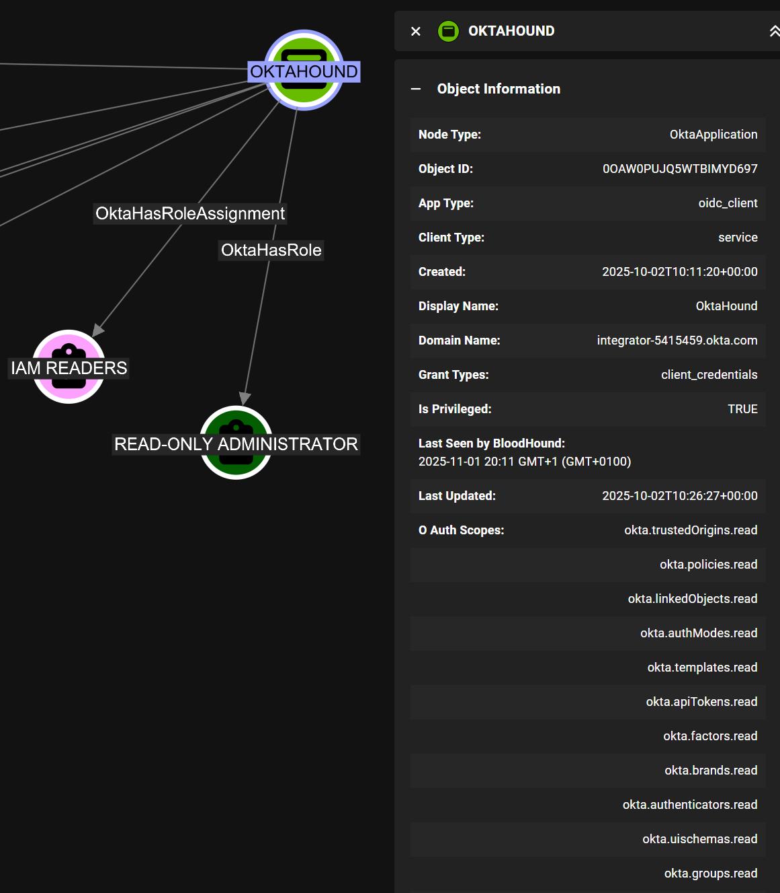

> [!WARNING]
> Research of role mapping and scope grants for API service applications in Okta is still ongoing.

## Hybrid Identities

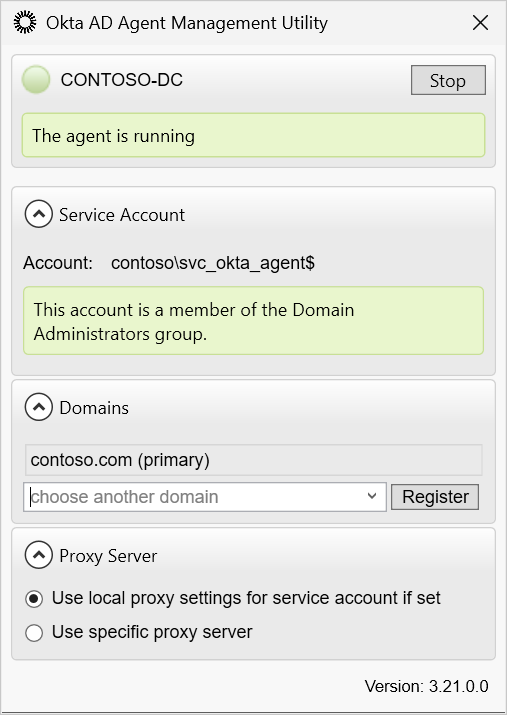

Possibly inbound and outbound control:

    - [x] AD to Okta user sync
    - [x] AD to Okta group sync
    - [ ]

- AD
  - [AD Desktop SSO](https://help.okta.com/oie/en-us/content/topics/directory/ad-dsso-about-workflow.htm)
  - Sync and delegated authentication Agents
- Entra ID
- GitHub IdP
- ...

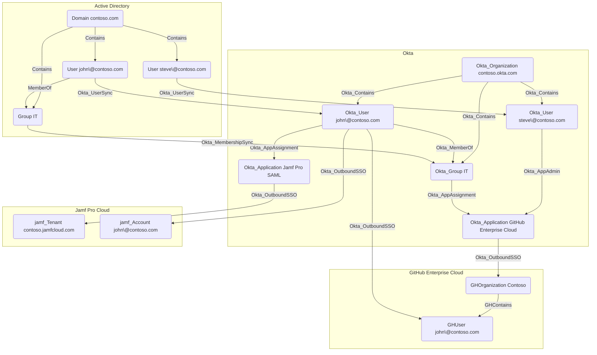

## GitHub Enterprise Cloud Organizations

When integrating Okta with GitHub Enterprise Cloud, each GitHub organization connected to Okta is represented as a separate `Okta_Application` node in BloodHound.

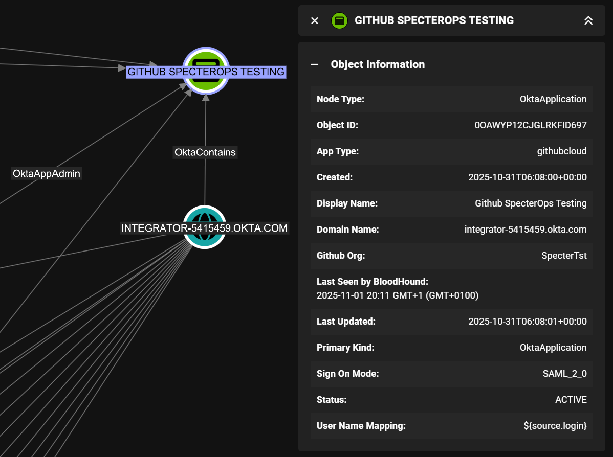

> [!WARNING]
> User mapping between `OktaHound` and `GitHound` is not implemented at this time.

## AWS Accounts

> [!WARNING]
> Support for AWS accounts and roles in Okta is not implemented at this time.

## Jamf Pro

When integrating Okta with Jamf Pro using SAML 2.0, each Jamf Pro instance connected to Okta is represented as a separate `Okta_Application` node in BloodHound.
The differentiator is the `domainFQDN` property:

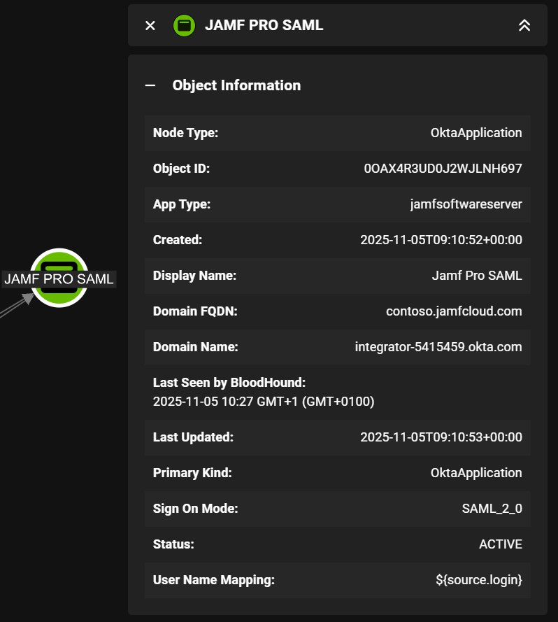

It is also possible to integrate Jamf Pro with Okta using Secure Web Authentication (SWA), but this option is less secure.

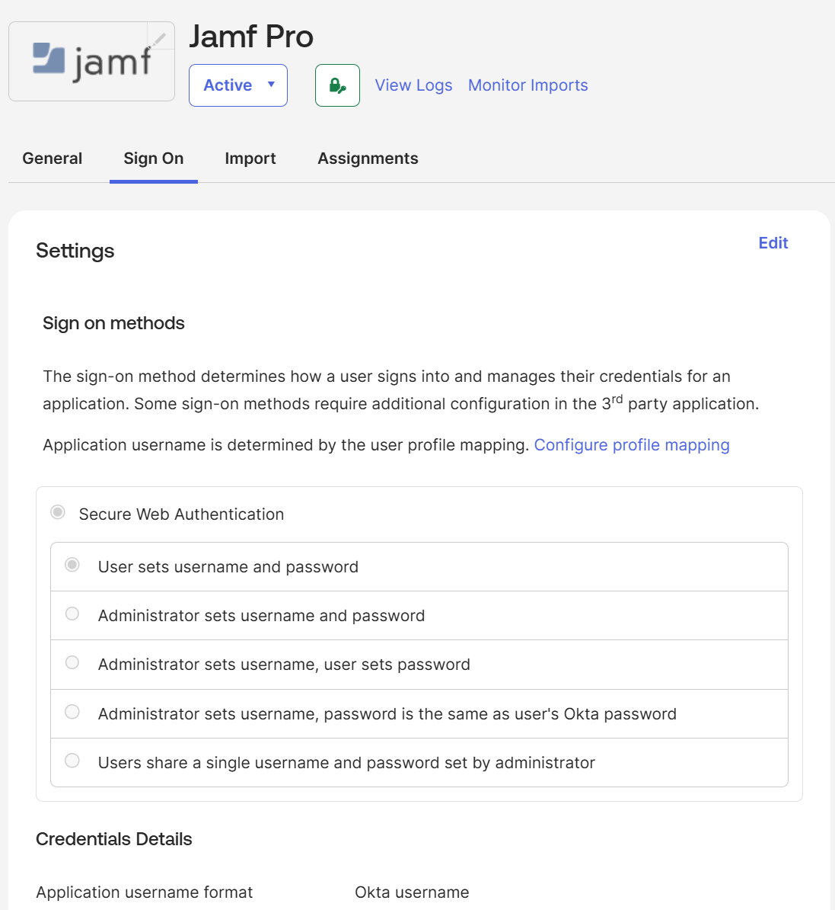

## Google Workspace

Similarly to the Jamf Pro SAML applications, each Google Workspace (formerly G Suite) instance connected to Okta using SAML 2.0 is represented as a separate `Okta_Application` node in BloodHound and is identified by the `domainFQDN` property:

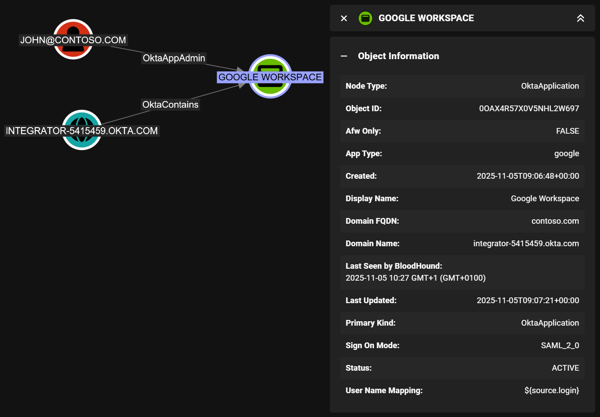

The SAML 2.0 protocol should always be preferred to SWA when integrating Okta with Google Workspace:

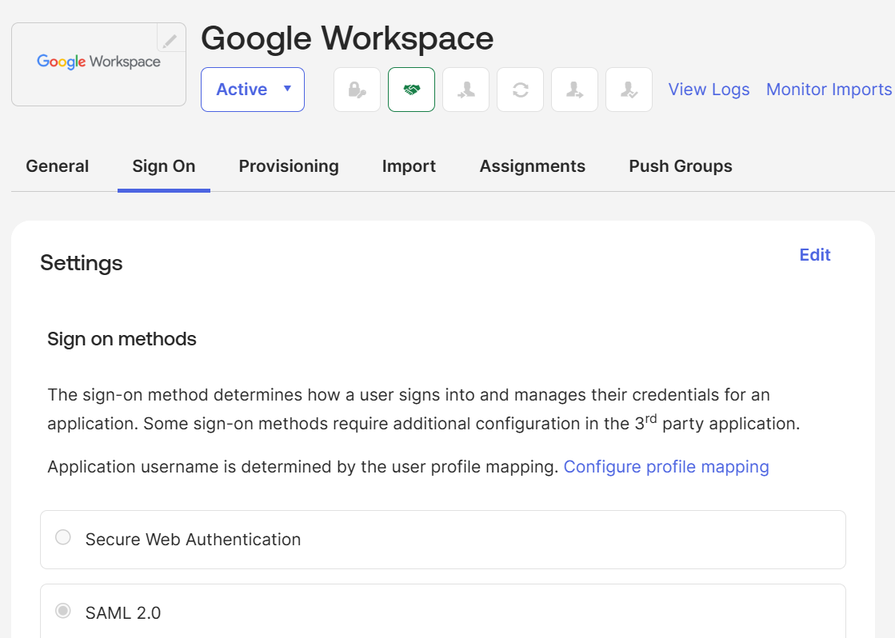

## Generic SAML 2.0 Applications

The assertion consumer service (ACS) URLs of generic (non-Catalog) Okta SAML 2.0 applications are exposed via the `url` attribute in BloodHound.

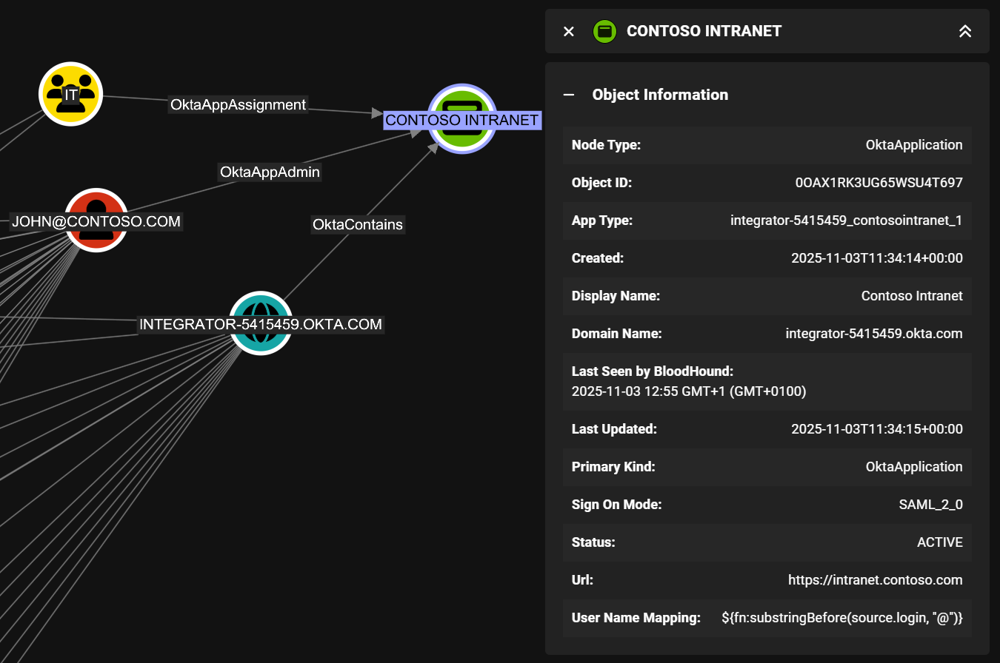

## Generic Secure Web Authentication (SWA) Applications

Secure Web Authentication (SWA) is an Okta technology that provides Single Sign-On (SSO) functionality to external web applications that don't support federated protocols. SWA applications store user credentials in Okta and automatically fill them in when users access the application through the Okta dashboard.

The app's login page URL is exposed via the `url` attribute in BloodHound.

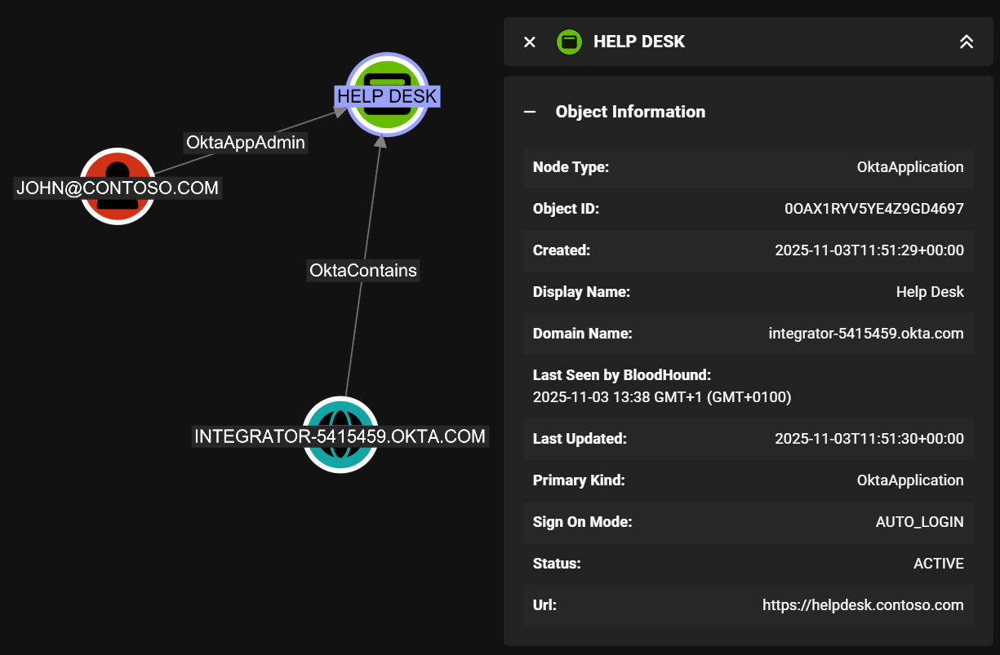

> [!WARNING]
> TODO: Fetch a list of stored credentials for SWA applications, if the API allows it.

## Generic OpenID Connect (OIDC) Applications

Okta supports three types of OIDC applications:

- Web Application
- Single-Page Application (SPA)
- Native Application

The default redirect URI of generic (non-Catalog) Okta OIDC single-page applications (SPAs) starts with `http://localhost:8080/`, making it hard to identify the actual application address. The optional Okta-initiated sign-in flow URL is therefore exposed in the `url` attribute in BloodHound instead, if configured.

OIDC applications can be granted OAuth 2.0 scopes to access Okta APIs on behalf of users:

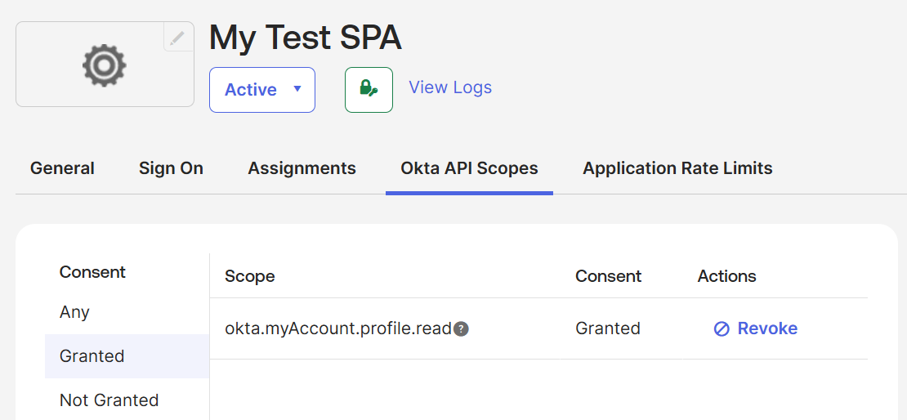

## SCIM-Enabled Applications

The `features` attribute of `Okta_Application` nodes may contain the following SCIM-related values,
indicating if SCIM is enabled and which protocol capabilities are supported:

| Freature                   | Description                                      |
|---------------------------|--------------------------------------------------|
| PUSH_NEW_USERS            | Supports pushing new users from Okta to the application |
| PUSH_PASSWORD_UPDATES     | Supports pushing password updates from Okta to the application |
| PUSH_PENDING_USERS        | Supports pushing pending users from Okta to the application |
| PUSH_PROFILE_UPDATES      | Supports pushing profile updates from Okta to the application |
| PUSH_USER_DEACTIVATION   | Supports pushing user deactivation from Okta to the application |
| REACTIVATE_USERS          | Supports reactivating users in the application from Okta |
| IMPORT_NEW_USERS          | Supports importing new users into the application from Okta |
| OPP_SCIM_INCREMENTAL_IMPORTS* | Supports incremental imports of users into the application from Okta |
| IMPORT_PROFILE_UPDATES    | Supports importing profile updates into Okta from the application |
| GROUP_PUSH                | Supports pushing groups and group memberships from Okta to the application |

