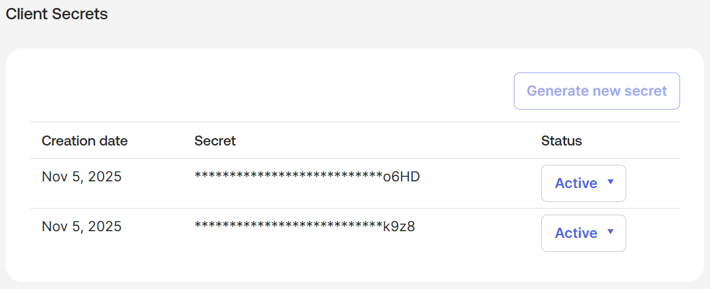

# Okta_ClientSecret

## Overview

Client secrets are used by API service integrations and OIDC applications to authenticate with Okta and obtain access tokens.


An application can have up to two client secrets configured, to allow for secret rotation.



Client secrets are represented as `Okta_ClientSecret` nodes in BloodHound.

## Properties

| Name | Source | Type | Description |
| ---- | ------ | ---- | ----------- |
| `id` | `secret.id` | `string` | Unique client secret identifier. |
| `name` | `secret.secretHash` | `string` | Hash of the secret value used as name/display label. |
| `displayName` | `secret.secretHash` | `string` | Display label used in BloodHound. |
| `oktaDomain` | Collector context (non-API) | `string` | Okta organization domain where the client secret exists. |
| `status` | `secret.status` | `string` | Current lifecycle status of the secret. |
| `created` | `secret.created` | `datetime` | Secret creation timestamp. |
| `lastUpdated` | `secret.lastUpdated` | `datetime` | Last update timestamp for the secret metadata. |

## Sample Property Values

```yaml
id: ocsxqwizfyqsf0aVG697
name: T1e6fl4jGqvPkgd94NKx5g
displayName: T1e6fl4jGqvPkgd94NKx5g
oktaDomain: contoso.okta.com
status: ACTIVE
created: 2025-11-24T12:24:08.000Z
lastUpdated: 2025-11-24T12:24:08.000Z
```

> [!NOTE]
> For security reasons, the OktaHound collector does not write cleartext client secrets
> to the OpenGraph JSON, only their hashed identifiers.
