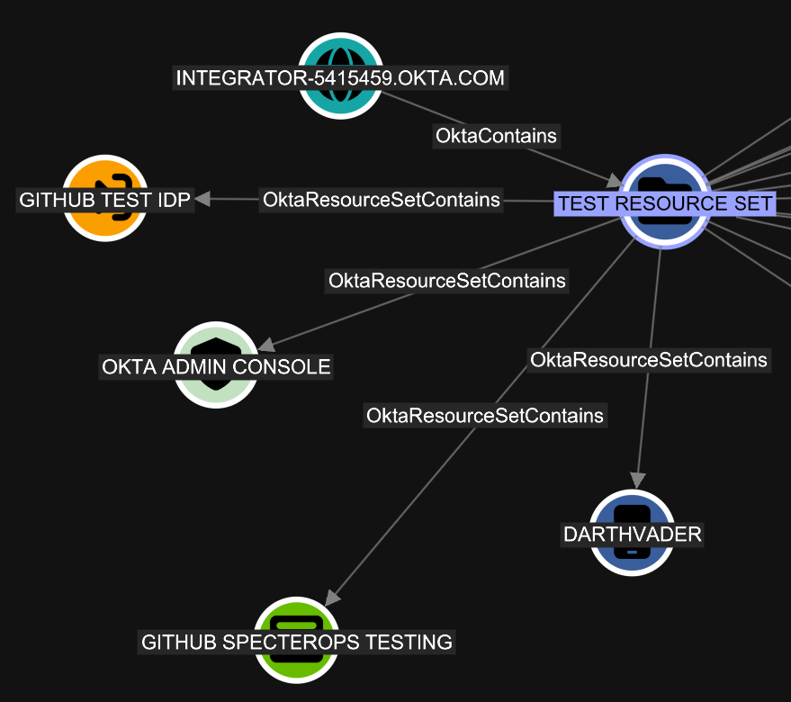

## Overview

Resource sets are collections of entities that can be used to scope custom role assignments in Okta.
A resource set can contain the following object types:

- [x] [Users](Okta_User.md)
- [x] [Groups](Okta_Group.md)
- [x] [Applications](Okta_Application.md)
- [x] [API Service Integrations](Okta_ApiServiceIntegration.md)
- [x] [Devices](Okta_Device.md)
- [x] [Authorization servers](Okta_AuthorizationServer.md)
- [x] [Identity Providers](Okta_IdentityProvider.md)
- [x] [Policies](Okta_Policy.md)
  - [x] Entity risk policy
  - [x] Session protection policy
  - [x] Authentication policy
  - [x] Global session policy
  - [x] End user account management policy
- [ ] Shared Signals Framework (SSF) Receivers
- [ ] ~~Workflows~~ (Gaps in the Okta API)
- [ ] ~~Customizations~~ (Gaps in the Okta API)
- [ ] ~~Support cases~~ (Gaps in the Okta API)
- [ ] ~~Identity and Access Management Resources~~ (Gaps in the Okta API)

> [!NOTE]
> Only the marked resource types are currently supported by `OktaHound` as resource set members.
> Some resource types, such as Workflows, are not accessible via the Okta API at all.



In `OktaHound`, resource sets are represented as `Okta_ResourceSet` nodes.

> [!NOTE]
> The built-in resource set `Workflows Resource Set` has the `WORKFLOWS_IAM_POLICY` identifier in all Okta organizations.
> To make it unique, the `OktaHound` collector adds the organization domain name as a suffix to the resource set's ID, e.g., `WORKFLOWS_IAM_POLICY@contoso.okta.com`.

## Properties

| Name | Source | Type | Description |
| ---- | ------ | ---- | ----------- |
| `id` | `MakeResourceSetIdUnique(resourceSet.Id, domainName)` | `string` | Unique resource set identifier (domain-qualified). |
| `name` | Constructor argument `name` | `string` | Resource set name. |
| `displayName` | Constructor argument `name` | `string` | Display-friendly resource set name. |
| `oktaDomain` | Constructor argument `oktaDomain` | `string` | Okta tenant domain used by the collector. |
| `description` | Constructor argument `description` | `string` | Resource set description text. |
| `created` | Constructor argument `created` | `datetime` | Resource set creation timestamp. |
| `lastUpdated` | Constructor argument `lastUpdated` | `datetime` | Last resource set update timestamp. |

## Sample Property Values

```yaml
id: WORKFLOWS_IAM_POLICY@contoso.okta.com
name: Workflows Resource Set
displayName: Workflows Resource Set
oktaDomain: contoso.okta.com
description: A resource set managed by Workflows Administrator
created: 2025-10-22T13:29:26+00:00
lastUpdated: 2025-10-22T13:29:26+00:00
```
