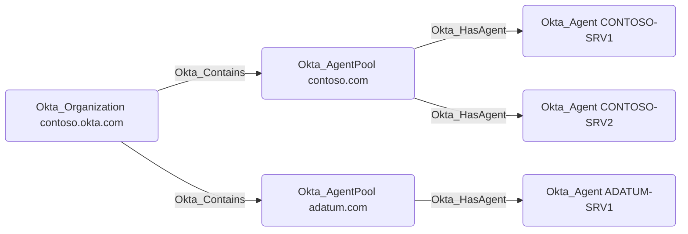

# Okta_AgentPool Node

## Overview

The `Okta_AgentPool` nodes represent Okta Agent Pools, which are collections of Okta Agents (represented as [Okta_Agent](Okta_Agent.md) nodes) that work together to provide high availability and load balancing for on-premises integrations.

The following agent pool types are supported by Okta:

| Agent Pool Type | Description |
|-----------------|-------------|
| AD              | [Active Directory](https://help.okta.com/en-us/content/topics/directory/ad-agent-integration-implementation-options.htm) |
| IWA             | [Integrated Windows Authentication (Kerberos/NTLM)](https://help.okta.com/en-us/content/topics/directory/ad-iwa-learn.htm) |
| LDAP            | [Lightweight Directory Access Protocol](https://help.okta.com/en-us/content/topics/directory/ldap-agent-supported-directories.htm) |
| RADIUS          | [RADIUS authentication proxy](https://help.okta.com/en-us/content/topics/integrations/radius-best-pract-flow.htm) |
| MFA             |  |
| OPP             |  |
| RUM             |  |

The most common agent pool type is the Active Directory (AD) Agent Pool, which consists of one or more AD Agents that facilitate bi-directional object synchronization between Okta and on-premises Active Directory environments.

## Okta_HasAgent Edges

`Okta_AgentPool` nodes are connected to their constituent `Okta_Agent` nodes via `Okta_HasAgent` edges. Active Directory Agent Pools and their agents can be visualized in BloodHound as follows:

> [!WARNING]
> Traversable edges between the `Okta_AgentPool` and AD `Domain` nodes are not created in the current version of `OktaHound`.
> This functionality is planned for a future release.
