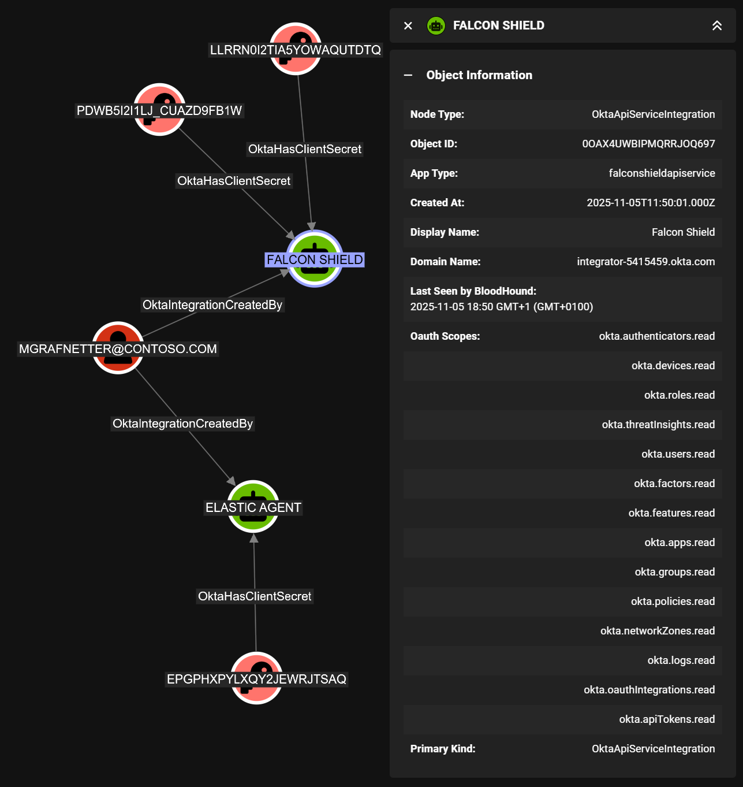
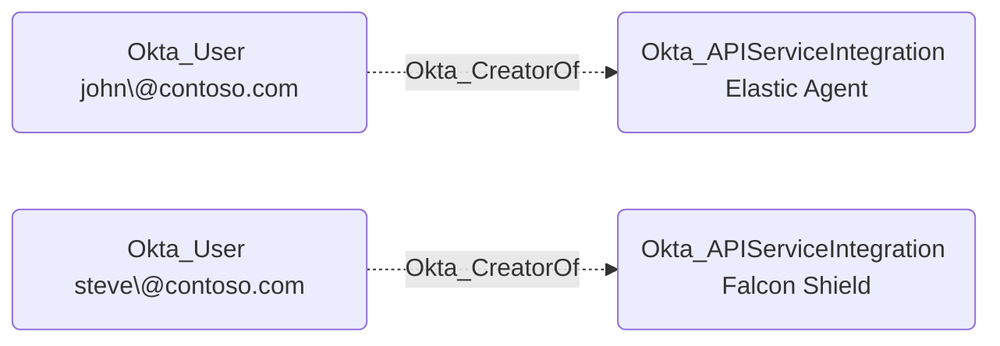
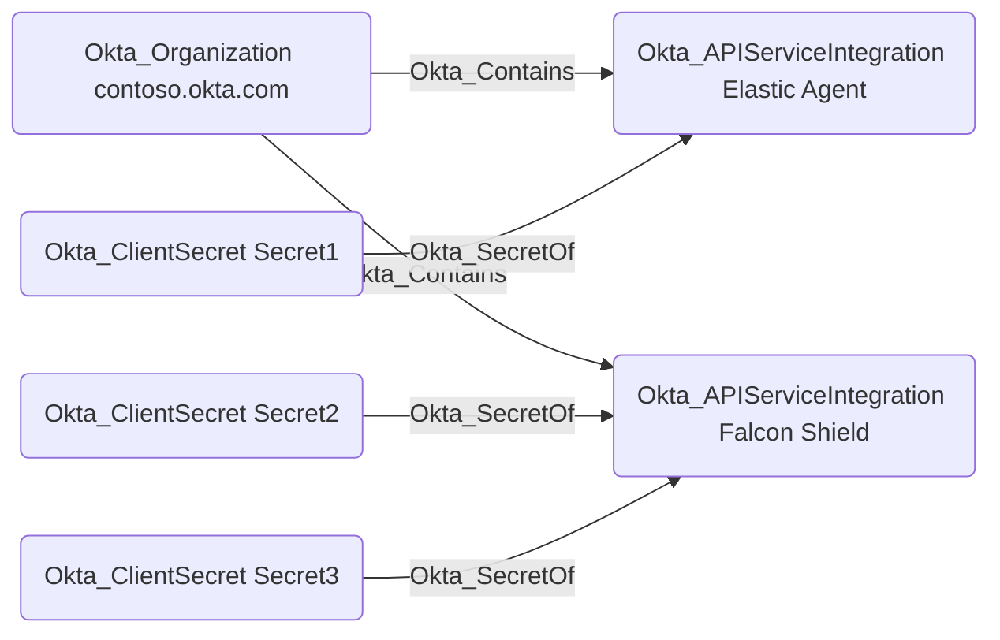

# Okta_ApiServiceIntegration Node

## Overview

API service integrations in Okta represent OAuth 2.0 service (daemon) applications that can be granted machine-to-machine access to Okta APIs. There are some important differences between API service integrations and [regular OIDC service applications in Okta](Okta_Application.md):

| Feature                                      | Service Applications | API Service Integrations |
|----------------------------------------------|----------------------|--------------------------|
| Can be created manually:                     | ✅                  | ❌                       |
| Can be added from the OIN Catalog:           | ✅                  | ✅                       |
| Require role assignments:                    | ✅                  | ❌                       |
| Support authentication using client secrets: | ✅                  | ✅                       |
| Support authentication using private keys:   | ✅                  | ❌                       |

In `OktaHound`, API service integrations are represented as `Okta_ApiServiceIntegration` nodes.

## Integration OAuth 2.0 Scopes

Each API service integration comes with a pre-defined set of OAuth 2.0 scopes to access Okta APIs:

## Okta_CreatorOf Edges

The non-traversable `Okta_CreatorOf` edges represent the creator relationships between API Service Integration instances and users in Okta:

## Okta_SecretOf Edges

The traversable `Okta_SecretOf` edges represent the relationship between API service integrations and their associated client secrets:

