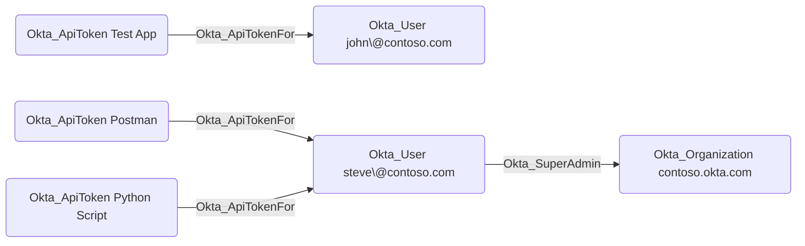

# Okta_ApiToken Node

## Overview

API tokens (also known as SSWS tokens) in Okta are used to authenticate and authorize access to the Okta API. They are typically used by applications and scripts that need to interact with Okta programmatically.

These tokens are always associated with a specific user in Okta, and the permissions of the token are determined by the role assignments of that user. For example, if a user has the Super Administrator role, any API token generated by that user will have full access to all API endpoints. Moreover, the long-lived API tokens are typically stored in plaintext in application configuration files or environment variables, making them a high-value target for attackers.

The use of API tokens is generally discouraged in favor of OAuth 2.0 access tokens, as they provide better security and flexibility. However, API tokens are still widely used by Okta customers.

In `OktaHound`, API tokens are represented as `Okta_ApiToken` nodes.

## Okta_ApiTokenFor Edges

The traversable `Okta_ApiTokenFor` edges represent the API token assignments for users in Okta, represented by the [Okta_User](Okta_User.md) nodes:

