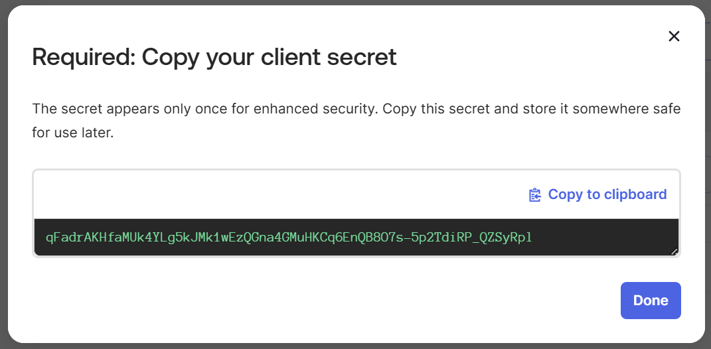
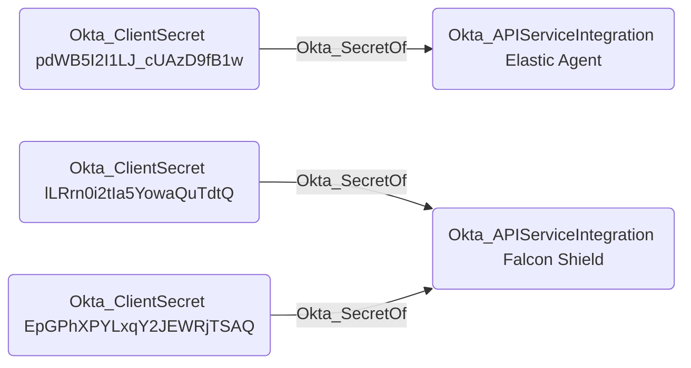

# Okta_ClientSecret Node

## Overview

Client secrets are used by API service integrations and OIDC applications to authenticate with Okta and obtain access tokens.

An application can have up to two client secrets configured, to allow for secret rotation.

Client secrets are represented as `Okta_ClientSecret` nodes in BloodHound.

## Okta_SecretOf Edges

The traversable `Okta_SecretOf` edges represent the relationships between applications ([Okta_Application](Okta_Application.md) and [Okta_APIServiceIntegration](Okta_APIServiceIntegration.md)) and their client secrets:

