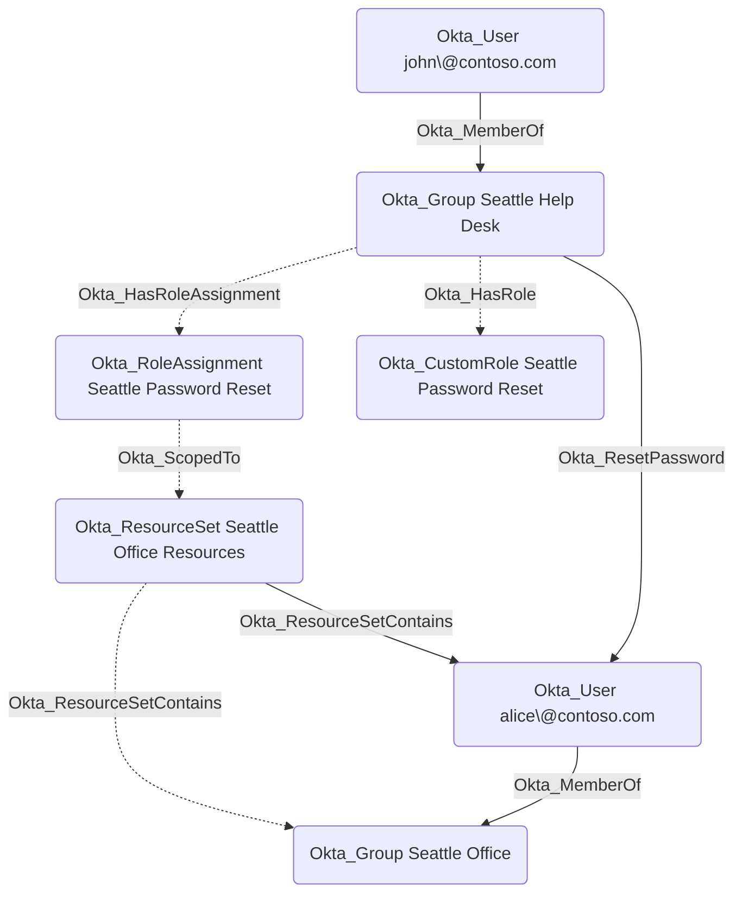
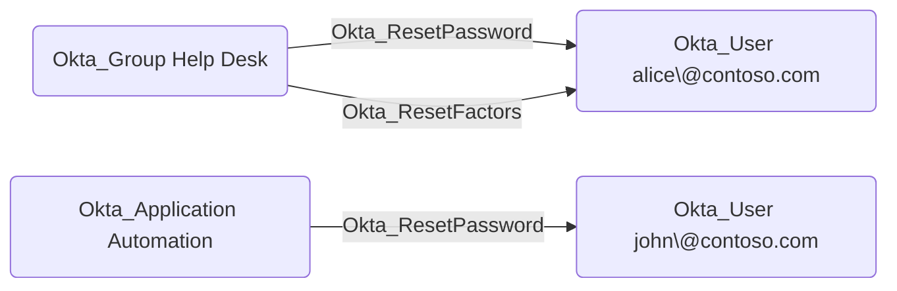
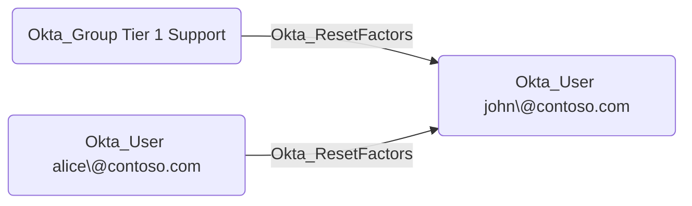
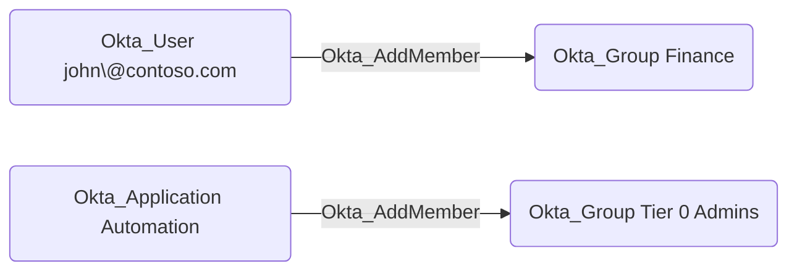
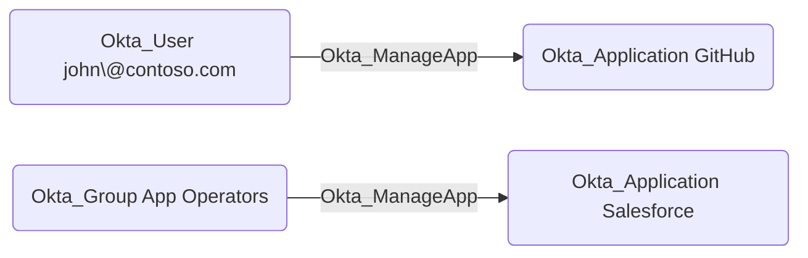

# Okta_CustomRole Node

## Overview

Custom roles can be created with specific [permissions](https://developer.okta.com/docs/api/openapi/okta-management/guides/permissions/)
and then assigned to [users](Okta_User.md), [groups](Okta_Group.md), and [applications](Okta_Application.md) over [resource sets](Okta_ResourceSet.md).
[Complex conditions](https://help.okta.com/oie/en-us/content/topics/security/custom-admin-role/permission-conditions.htm) can be used if the custom admin role has one of the following permissions:

- okta.users.read
- okta.users.manage
- okta.users.create

Custom roles are represented as `Okta_CustomRole` and `Okta_RoleAssignment` nodes in `OktaHound`, similar to built-in roles.

## Abusable Permissions of Custom Roles in Okta

The following Okta permissions are particularly interesting from an offensive security perspective,
as they can be abused to escalate privileges in hybrid scenarios:

- okta.users.manage
- okta.users.credentials.manage
- okta.users.credentials.resetFactors
- okta.users.credentials.resetPassword
- okta.users.credentials.expirePassword
- okta.users.credentials.manageTemporaryAccessCode
- okta.groups.manage
- okta.groups.members.manage
- okta.apps.manage

> [!WARNING]
> The research on abusable Okta permissions is still ongoing.

## Custom Role Assignment Edges

## Custom Role Permission Edges

Custom roles can grant scoped administrative permissions that result in the following traversable edges.

### Okta_ResetPassword Edges

The traversable `Okta_ResetPassword` edges represent custom role permissions that allow a principal (user, group, or application)
to reset passwords or temporary credentials for scoped Okta users.
These edges are created when a custom role includes
password management permissions such as `okta.users.credentials.resetPassword`, `okta.users.credentials.manage`, `okta.users.credentials.manageTemporaryAccessCode`, or `okta.users.manage`.

### Okta_ResetFactors Edges

The traversable `Okta_ResetFactors` edges represent custom role permissions that allow a principal to reset MFA authenticators
for scoped Okta users. These edges are created when a custom role includes the `okta.users.credentials.resetFactors` or `okta.users.credentials.manage` permissions.

### Okta_AddMember Edges

The traversable `Okta_AddMember` edges represent custom role permissions that allow a principal (user, group, or application)
to add or remove members in scoped Okta groups. These edges are created when a custom role includes
the `okta.groups.members.manage` or `okta.groups.manage` permissions.

### Okta_ManageApp Edges

The traversable `Okta_ManageApp` edges correspond to the `okta.apps.manage` custom role permissions
that allow a principal (user, group, or application) to fully manage Okta applications and their members.

