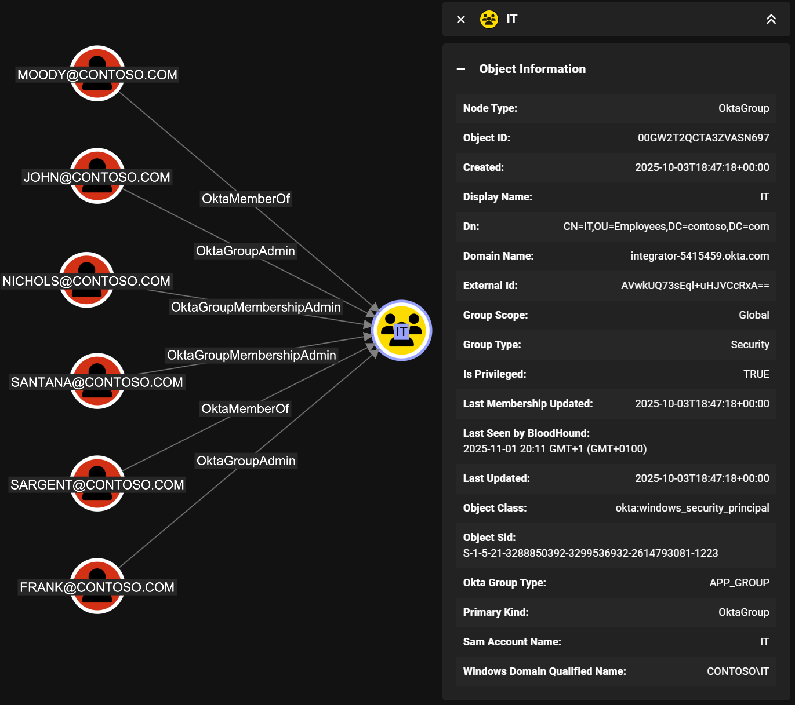
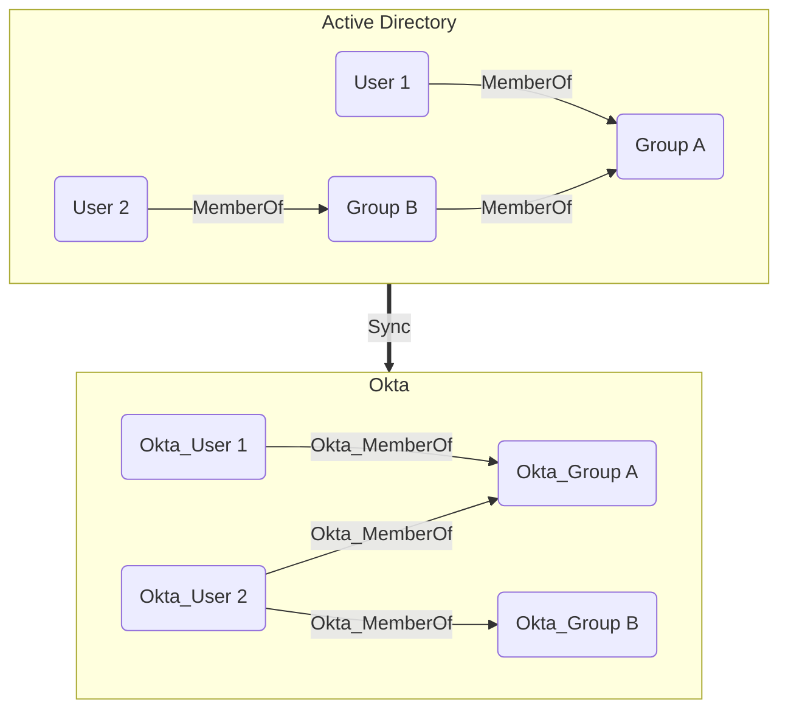
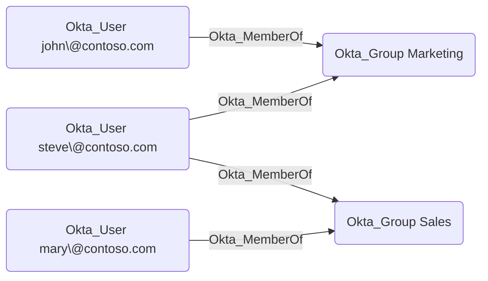
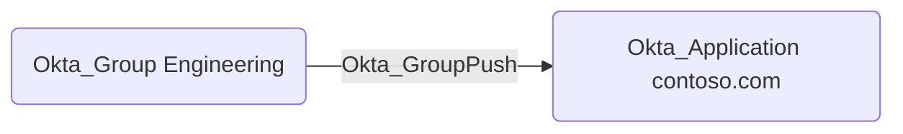
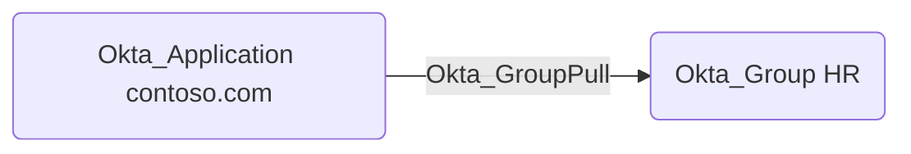
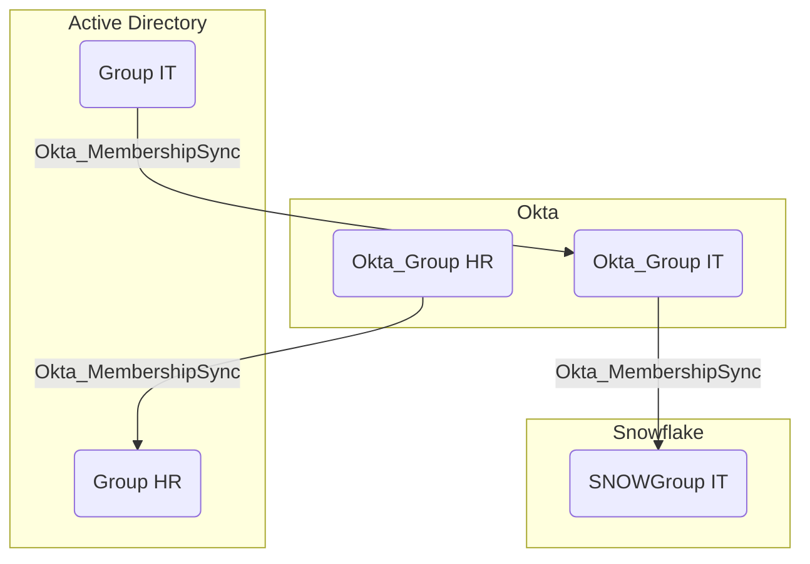

# Okta_Group Node

## Overview

Groups in Okta are collections of users that can be used to manage access to applications and resources. Groups can be created manually or synchronized from external directories such as Active Directory.
The built-in **Everyone** group always contains all users in the Okta organization. Only users can be members of groups and groups cannot be nested.

In `OktaHound`, groups are represented as `Okta_Group` nodes.

## Synchronization with External Directories

Similarly to users, groups can also be synchronized from external directories. The Okta API exposes the original Active Directory attributes, which are then collected by `OktaHound`:

Nested (transitive) group memberships in Active Directory are always flattened (resolved) when synchronized to Okta, as illustrated below:

## Okta_MemberOf Edges

The traversable `Okta_MemberOf` edges represent the membership relationships between users and groups in Okta:

## Okta_GroupPush Edges

The non-traversable `Okta_GroupPush` edges represent the group push assignments to applications.
This indicates group provisioning and membership synchronization from Okta to external applications.

## Okta_GroupPull Edges

The traversable `Okta_GroupPull` edges represent the group synchronization relationships from applications to Okta:

## Okta_MembershipSync Edges

The traversable hybrid `Okta_MembershipSync` edges represent the synchronization relationships between groups in external directories and their corresponding groups in Okta:

