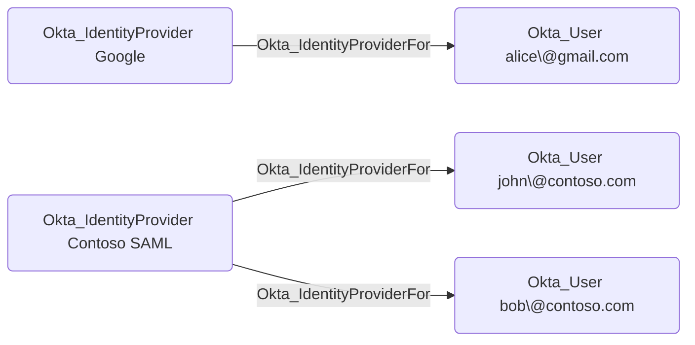
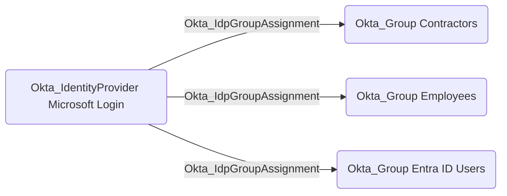
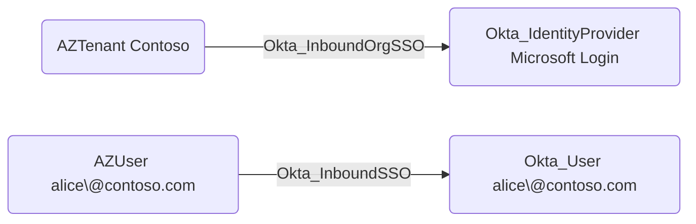

# Okta_IdentityProvider Node

## Overview

Identity Providers (IdPs) in Okta represent external authentication sources that can be used to authenticate users. These can include social identity providers (such as Google, Facebook, or Microsoft), enterprise identity providers using SAML or OIDC, or other Okta organizations in an Org2Org configuration.

When users authenticate through an external identity provider, Okta can optionally create or link user accounts, enabling federated authentication across multiple systems.

In `OktaHound`, identity providers are represented as `Okta_IdentityProvider` nodes.

> [!WARNING]
> The inbound identity provider routing rules and JIT (Just-In-Time) provisioning settings are currently not evaluated by `OktaHound`.

## Okta_IdentityProviderFor Edges

The traversable `Okta_IdentityProviderFor` edges represent the relationships between identity providers and the users who authenticate through them:

## Okta_IdpGroupAssignment Edges

The non-traversable `Okta_IdpGroupAssignment` edges represent groups automatically assigned to users based on identity provider attributes or user claims:

## Hybrid Identity Edges

The `Okta_InboundOrgSSO` and `Okta_InboundSSO` hybrid edges connect external tenants and users to Okta entities:

