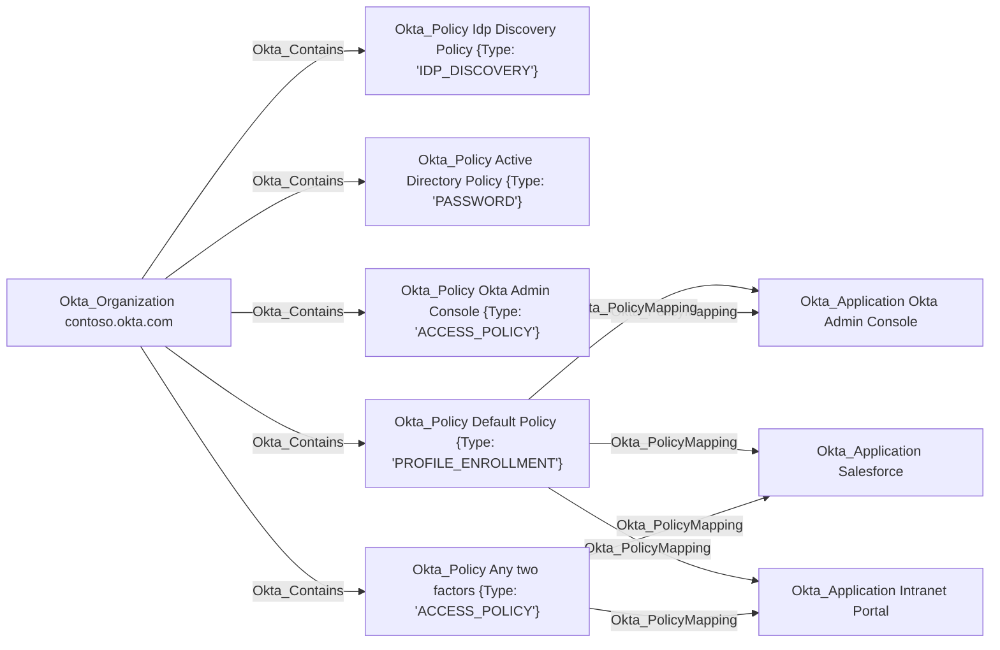

# Okta_Policy Node

## Overview

Policies in Okta define the rules and conditions that govern authentication, authorization, and security behaviors within an organization. They control aspects such as password requirements, MFA enrollment, session management, and application access.

In `OktaHound`, policies are represented as `Okta_Policy` nodes.

The following [policy types](https://developer.okta.com/docs/api/openapi/okta-management/management/tag/Policy/) are supported by Okta:

| Policy Type ID | Description |
|----------------|-------------|
| OKTA_SIGN_ON | [Global session policies](https://help.okta.com/oie/en-us/content/topics/identity-engine/policies/about-okta-sign-on-policies.htm) |
| PASSWORD | [Password policies](https://help.okta.com/en-us/content/topics/security/policies/about-password-policies.htm) |
| MFA_ENROLL | [Authenticator enrollment policies](https://help.okta.com/en-us/content/topics/security/policies/configure-mfa-policies.htm) |
| IDP_DISCOVERY | [Identity Provider routing rules](https://help.okta.com/en-us/content/topics/security/identity_provider_discovery.htm) |
| ACCESS_POLICY | [App sign-in policies](https://help.okta.com/oie/en-us/content/topics/identity-engine/policies/about-app-sign-on-policies.htm) |
| DEVICE_SIGNAL_COLLECTION | [Device signal collection policies](https://help.okta.com/oie/en-us/content/topics/identity-engine/policies/create-device-signal-collection-ruleset.htm) |
| PROFILE_ENROLLMENT | [User profile policies](https://help.okta.com/oie/en-us/content/topics/identity-engine/policies/create-profile-enrollment-policy.htm) |
| POST_AUTH_SESSION | [Identity Threat Protection policies](https://help.okta.com/oie/en-us/content/topics/itp/overview.htm) |
| ENTITY_RISK | [Entity risk policies](https://help.okta.com/oie/en-us/content/topics/itp/entity-risk-policy.htm) |

The `OktaHound` collector specifically reads the `IDP_DISCOVERY` policies to check
if the [Agentless Desktop SSO](https://help.okta.com/en-us/content/topics/directory/configuring_agentless_sso.htm) feature is enabled in the organization through at least one such policy.

## Okta_PolicyMapping Edges

The non-traversable `Okta_PolicyMapping` edges represent the association between a policy and the resources to which it is applied.

> [!WARNING]
> Only application targets are currently supported by `OktaHound`.

