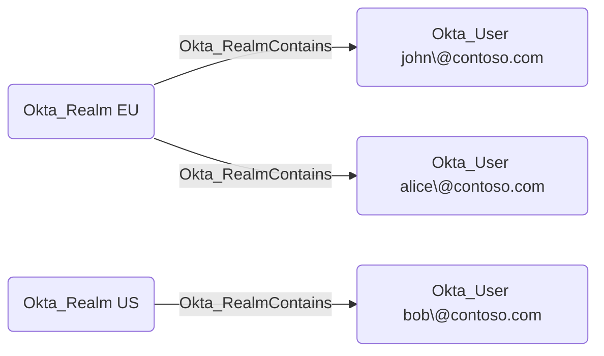

# Okta_Realm Node

## Overview

Okta Realms are used to define authentication boundaries within an Okta organization. They allow administrators to segment users and applications based on different criteria, such as geographic location, business unit, or security requirements.

In `OktaHound`, Okta Realms are represented as `Okta_Realm` nodes.

## Okta_RealmContains Edges

The traversable `Okta_RealmContains` edges represent containment relationships between realms and the users assigned to those realms.

> [!WARNING]
> Okta Realms are currently not supported by `OktaHound` due to licensing restrictions.
