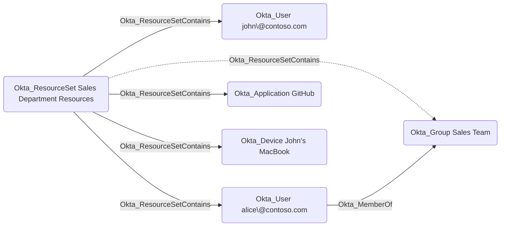

# Okta_ResourceSet Node

## Overview

Resource sets are collections of entities that can be used to scope custom role assignments in Okta.
A resource set can contain the following object types:

- [x] [Users](Okta_User.md)
- [x] [Groups](Okta_Group.md)
- [x] [Applications](Okta_Application.md)
- [x] [API Service Integrations](Okta_ApiServiceIntegration.md)
- [x] [Devices](Okta_Device.md)
- [x] [Authorization servers](Okta_AuthorizationServer.md)
- [x] [Identity Providers](Okta_IdentityProvider.md)
- [x] [Policies](Okta_Policy.md)
  - [x] Entity risk policy
  - [x] Session protection policy
  - [x] Authentication policy
  - [x] Global session policy
  - [x] End user account management policy
- [ ] Shared Signals Framework (SSF) Receivers
- [ ] ~~Workflows~~ (Gaps in the Okta API)
- [ ] ~~Customizations~~ (Gaps in the Okta API)
- [ ] ~~Support cases~~ (Gaps in the Okta API)
- [ ] ~~Identity and Access Management Resources~~ (Gaps in the Okta API)

> [!NOTE]
> Only the marked resource types are currently supported by `OktaHound` as resource set members.
> Some resource types, such as Workflows, are not accessible via the Okta API at all.

In `OktaHound`, resource sets are represented as `Okta_ResourceSet` nodes.

> [!NOTE]
> The built-in resource set `Workflows Resource Set` has the `WORKFLOWS_IAM_POLICY` identifier in all Okta organizations.
> To make it unique, the `OktaHound` collector adds the organization domain name as a suffix to the resource set's ID, e.g., `WORKFLOWS_IAM_POLICY@contoso.okta.com`.

## Okta_ResourceSetContains Edges

The traversable `Okta_ResourceSetContains` edges represent the membership relationships between resource sets and their member entities in Okta:

Note that users can also be members of resource sets indirectly through group memberships.
The intermediate group will not appear in the graph, but the user membership will be resolved by `OktaHound`.
