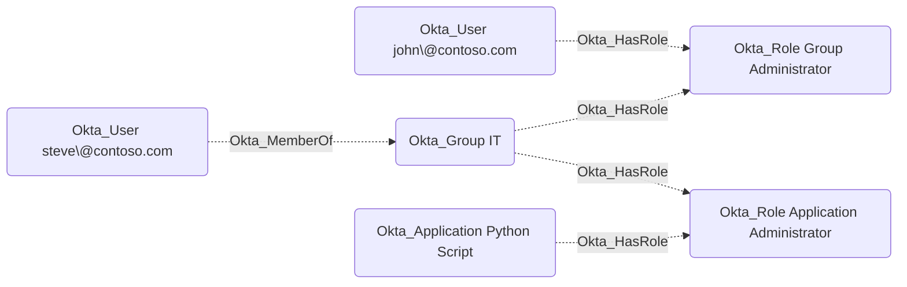
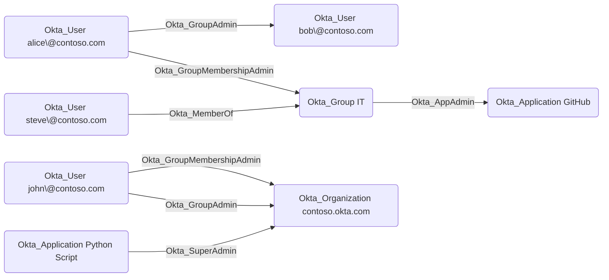
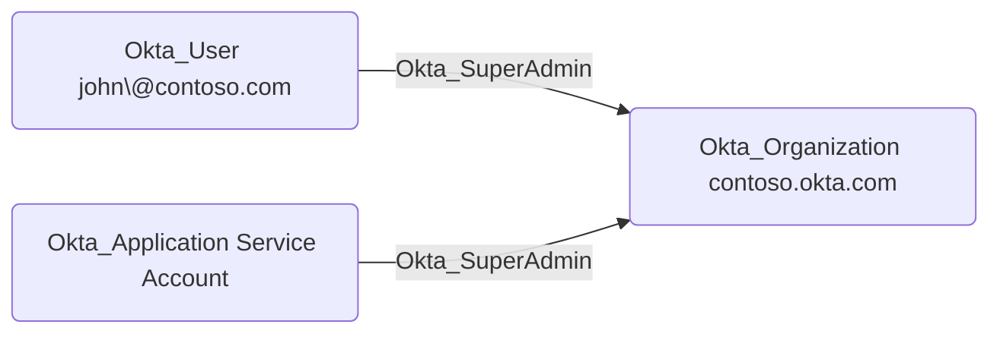
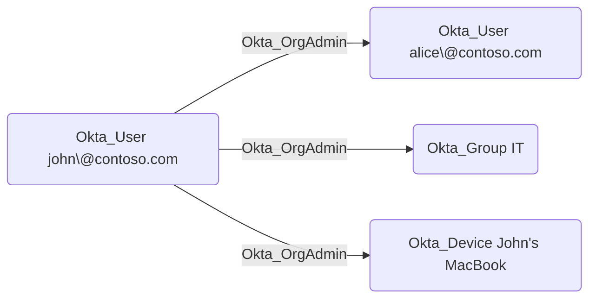
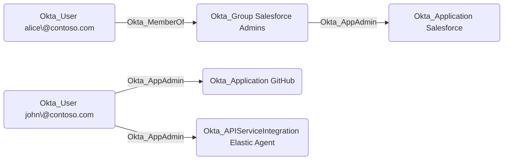
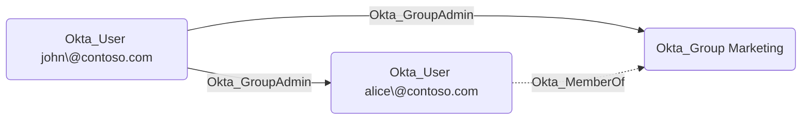
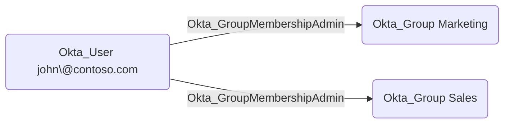
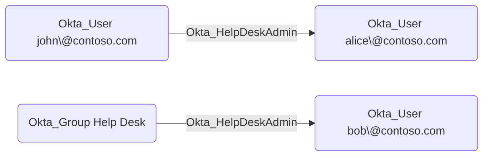
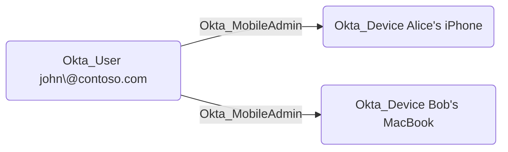

# Okta_Role Node

## Overview

Okta provides a handful of [built-in administrative roles](https://help.okta.com/en-us/content/topics/security/administrators-admin-comparison.htm) that can be assigned to users, groups, and applications to delegate administrative tasks. These roles have predefined permissions and cannot be modified.

The following roles are organization-wide:

- Super Administrator
- Organization Administrator
- API Access Management Administrator
- Mobile Administrator
- Workflows Administrator
- Report Administrator
- Read-only Administrator

The most powerful role is the **Super Administrator**, which has full access to all features and settings in the Okta organization.

The following roles can either be scoped to specific resources or assigned organization-wide:

- Group Administrator (AKA User Administrator)
- Group Membership Administrator
- Help Desk Administrator
- Application Administrator

> [!NOTE]
> Although the Workflows Administrator role is a built-in role, the Okta API treats it as a custom role that is scoped to the built-in `Workflows Resource Set`.

In `OktaHound`, built-in roles are represented as `Okta_Role` nodes.

## Built-In Role Identifiers

When working with roles using the Okta API, the built-in roles are referenced by the following identifiers:

| Role Identifier             | Role Name                           |
|-----------------------------|-------------------------------------|
| SUPER_ADMIN                 | Super Administrator                 |
| ORG_ADMIN                   | Organization Administrator          |
| USER_ADMIN                  | Group Administrator                 |
| GROUP_MEMBERSHIP_ADMIN      | Group Membership Administrator      |
| APP_ADMIN                   | Application Administrator           |
| API_ACCESS_MANAGEMENT_ADMIN | API Access Management Administrator |
| ~~API_ADMIN~~               | API Administrator (Deprecated?)     |
| HELP_DESK_ADMIN             | Help Desk Administrator             |
| MOBILE_ADMIN                | Mobile Administrator                |
| WORKFLOWS_ADMIN             | Workflows Administrator             |
| REPORT_ADMIN                | Report Administrator                |
| READ_ONLY_ADMIN             | Read-Only Administrator             |

To make the role identifiers unique, the `OktaHound` collector adds the organization domain name as a suffix to each role's ID, e.g., `SUPER_ADMIN@contoso.okta.com`.

## Built-In Role Permissions

Unlike custom roles, built-in roles have fixed permissions that cannot be changed.
However, the exact OAuth 2.0 scopes granted to each built-in role are not publicly documented by Okta and cannot even be retrieved via the API.

> [!WARNING]
> Research on the exact permissions of built-in roles in Okta is still ongoing.

## Okta_HasRole Edges

The non-traversable `Okta_HasRole` edges represent the role assignments for users in Okta:

## Role Assignment Edges

The traversable `Okta_SuperAdmin`, `Okta_OrgAdmin`, `Okta_AppAdmin`, `Okta_GroupAdmin`, `Okta_GroupMembershipAdmin`, `Okta_HelpDeskAdmin`, and `Okta_MobileAdmin` edges represent the specific role assignments for users, groups, and applications in Okta, with target group memberships resolved:

> [!IMPORTANT]
> Users assigned the Super Admins and other privileged roles cannot be managed by users with lesser roles.
> Further research on role assignment hierarchies in Okta is still ongoing.

## Okta_SuperAdmin Edges

The traversable `Okta_SuperAdmin` edges represent Super Administrator role assignments to the Okta organization.
Super Administrators have full access to all features and settings in the Okta organization.

## Okta_OrgAdmin Edges

The traversable `Okta_OrgAdmin` edges represent Organization Administrator role assignments.
Organization Administrators can manage most organizational settings except for administrative role assignments and some security settings.

## Okta_AppAdmin Edges

The traversable `Okta_AppAdmin` edges represent Application Administrator role assignments.
Application Administrators can manage application configurations, user assignments, and provisioning settings for their assigned applications.

## Okta_GroupAdmin Edges

The traversable `Okta_GroupAdmin` edges represent Group Administrator (also known as User Administrator) role assignments.
Group Administrators can manage users and groups within their assigned scope.

Target group memberships are flattened when the assignment is evaluated.

## Okta_GroupMembershipAdmin Edges

The traversable `Okta_GroupMembershipAdmin` edges represent Group Membership Administrator role assignments.
Group Membership Administrators can add and remove members from groups within their assigned scope but cannot modify the groups themselves.

## Okta_HelpDeskAdmin Edges

The traversable `Okta_HelpDeskAdmin` edges represent Help Desk Administrator role assignments.
Help Desk Administrators can perform password resets, unlock accounts, and reset MFA factors for users within their assigned scope.

## Okta_MobileAdmin Edges

The traversable `Okta_MobileAdmin` edges represent Mobile Administrator role assignments.
Mobile Administrators can manage mobile device settings and configurations within their assigned scope.

