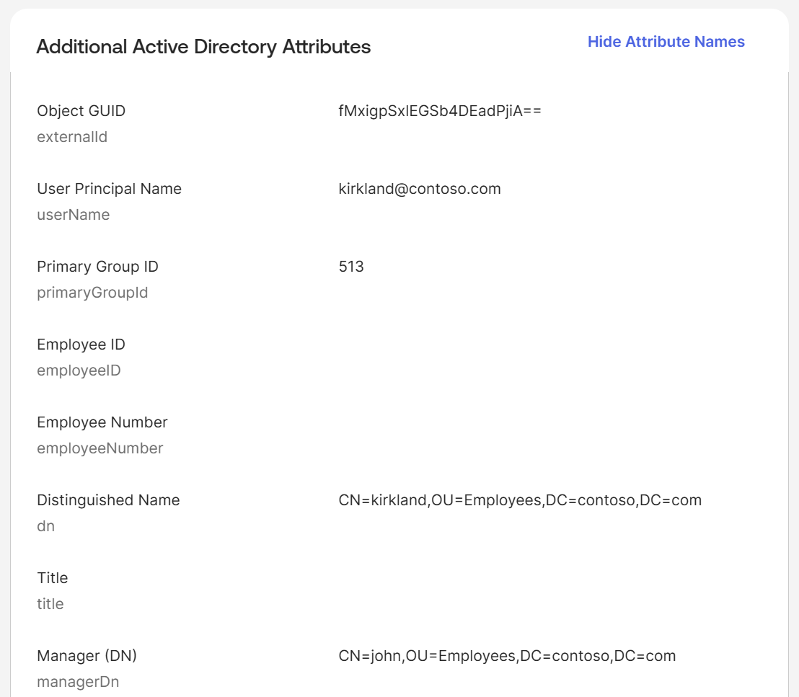
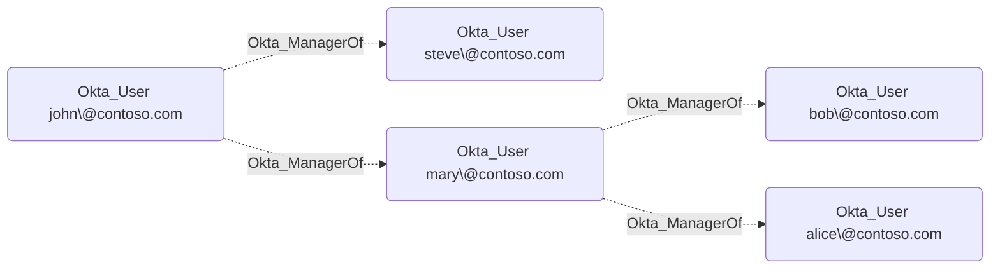
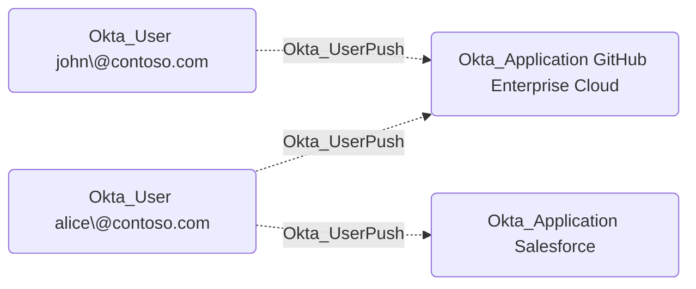
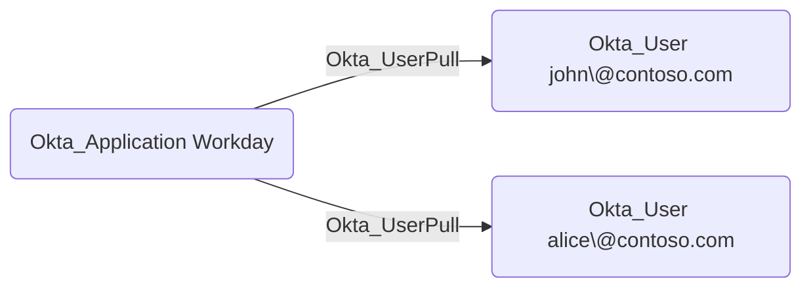
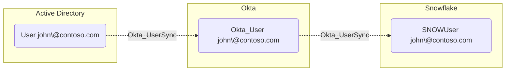
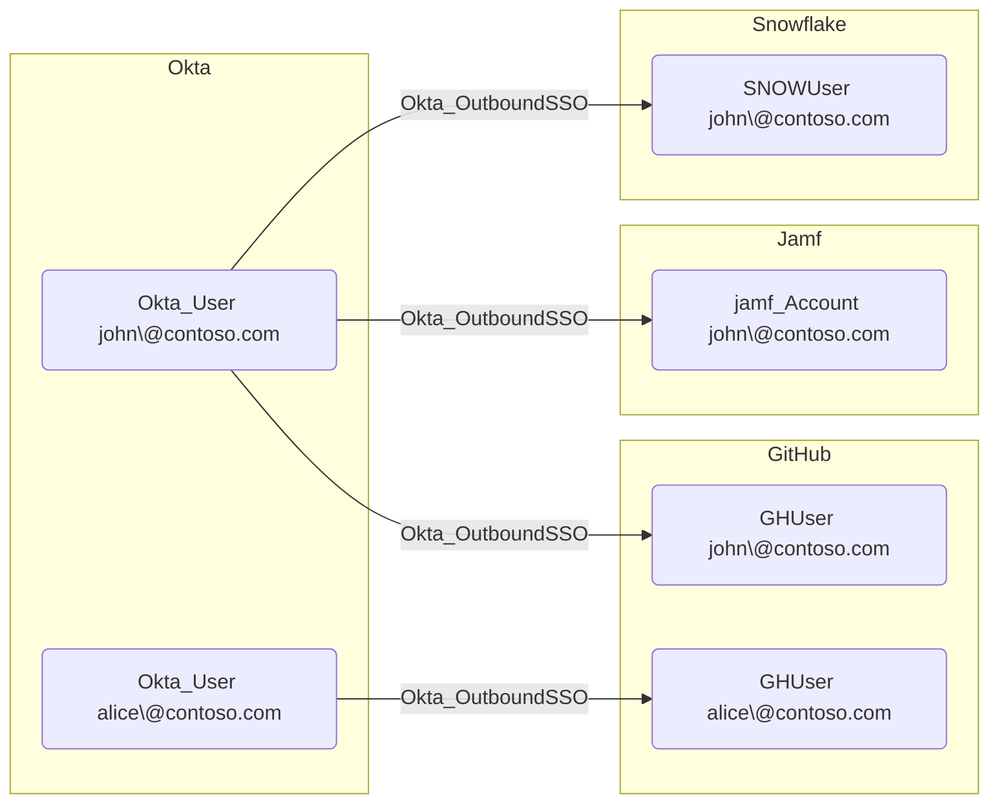
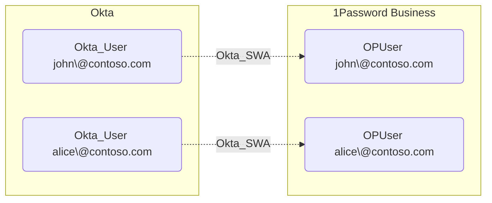

# Okta_User Node

## Overview

User objects (AKA People) represent individuals who have access to the Okta organization. Each user has a unique identifier, username in the email address format, and various attributes such as email, first name, last name, and status.

In `OktaHound`, users are represented as `Okta_User` nodes.

## User Status

User status can have [multiple values](https://developer.okta.com/docs/api/openapi/okta-management/management/tag/User), as illustrated below:

To simplify analysis in BloodHound, the `OktaHound` collector maps the **Status** attribute to the virtual boolean **Enabled** attribute as follows:

| Okta User Status | Enabled | Explanation                      |
|------------------|---------|----------------------------------|
| ACTIVE           | ✅     | User can authenticate.           |
| PASSWORD_EXPIRED | ✅     | User's password has expired but can still authenticate. |
| LOCKED_OUT       | ✅     | User is locked out but can still authenticate after unlocking. |
| PROVISIONED      | ✅     | User is provisioned but cannot authenticate yet. |
| RECOVERY         | ✅     | User is in recovery mode and cannot authenticate. |
| SUSPENDED        | ❌     | User is suspended and cannot authenticate. |
| STAGED           | ❌     | User is staged and cannot authenticate yet. |
| DEPROVISIONED    | ❌     | User is deprovisioned and cannot authenticate. |

> [!WARNING]
> This mapping is a simplification and may not cover all edge cases.
> Always refer to the actual **Status** attribute for precise user state information.

## Authentication Factors

Okta supports various authentication factors for multi-factor authentication (MFA),
such as SMS, email, push notifications, and hardware tokens.
In case of mobile and desktop applications, these authentication factors are associated with the [Device](Okta_Device.md) entities.
Other authentication factors, such as YubiKeys and Google Authenticator, are not represented as separate nodes in BloodHound,
but the number of enrolled factors is stored in the `authenticationFactors` attribute of the `Okta_User` nodes.

## Synchronization with External Directories

Users can be synchronized from external directories such as Active Directory (AD) or LDAP. When synchronized, certain attributes may be mapped from the external directory to the Okta user profile.

## Okta_ManagerOf Edges

Okta uses the `Manager` and `ManagerId` user profile attributes to represent managerial relationships. Unfortunately, these attributes can have any arbitrary value and their referential integrity is not enforced by Okta. They are not even synchronized from external directories by default.

Our recommendation is to map the `ManagerId` attribute to the login of the manager in Okta. When synchronizing users from Active Directory,
the `getManagerUser("active_directory").login` mapping expression can be used to achieve this. Such values are automatically recognized by `OktaHound`.

The **non-traversable** `Okta_ManagerOf` edges represent the organizational structure in BloodHound:

## Okta_UserPush Edges

The non-traversable `Okta_UserPush` edges represent user provisioning relationships from Okta to external applications. When configured, Okta can automatically create, update, or deactivate user accounts in integrated applications using protocols like SCIM or LDAP.

## Okta_UserPull Edges

The `Okta_UserPull` edges represent user import relationships from external applications to Okta.

## Okta_UserSync Edges

The non-traversable hybrid `Okta_UserSync` edges represent bidirectional user synchronization relationships between Okta and external directories or applications. These edges indicate that user accounts are linked and synchronized between systems.

## Okta_OutboundSSO Edges

The traversable hybrid `Okta_OutboundSSO` edges represent Single Sign-On relationships between Okta users and their linked accounts in external applications using federated authentication (SAML 2.0 or OIDC).

## Okta_SWA Edges

The non-traversable hybrid `Okta_SWA` edges represent Secure Web Authentication relationships between Okta users and their linked accounts in external applications. SWA stores user credentials in Okta and automatically fills them in, which is less secure than federated SSO.

