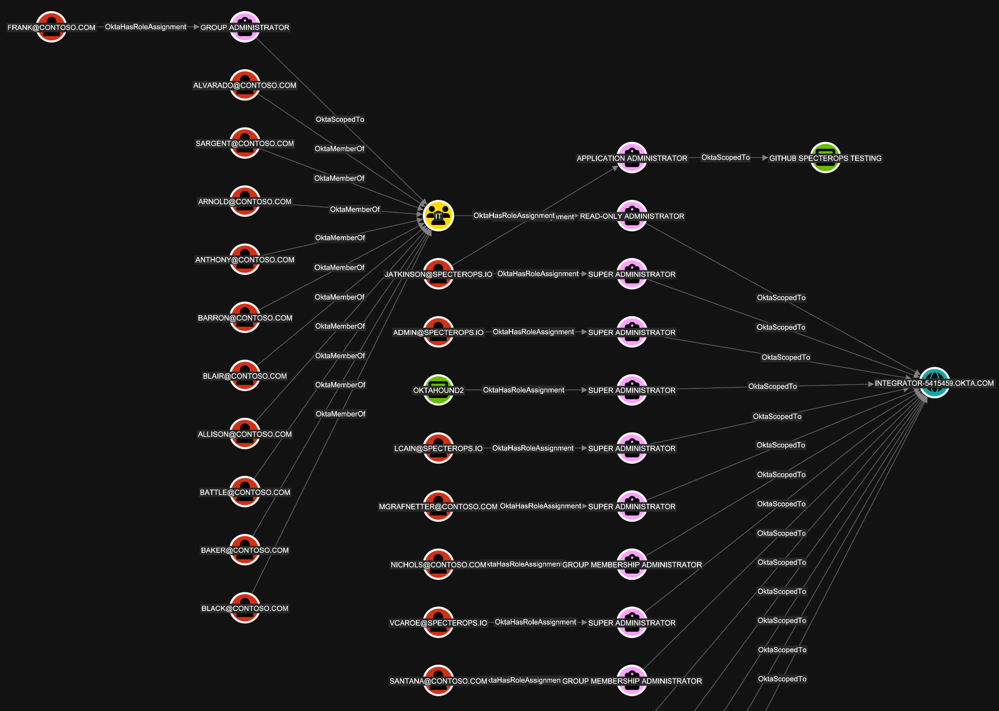

# OktaHound

**Okta Data Collector for BloodHound OpenGraph**

## Overview

`OktaHound` is a data collector for [Okta Platform](https://www.okta.com/products/workforce-identity/) (AKA Okta Workforce Identity Cloud) environments, that integrates with [BloodHound OpenGraph](https://specterops.io/opengraph/) to help security professionals visualize and analyze their Okta configurations.
It collects data about users, groups, applications, roles,
and other entities within an Okta organization and represents them as [nodes](Documentation/Schema.md#nodes)
and [edges](Documentation/Schema.md#edges) in BloodHound's graph database.

The other main product in Okta's portfolio is [Auth0](https://auth0.com/), previously known as Customer Identity Cloud. Auth0 is **not supported** by `OktaHound` at this time.

## Authors

### Michael Grafnetter - [SpecterOps](https://specterops.io)

### Lance Cain - [SpecterOps](https://specterops.io)

### Valdemar Carøe - [SpecterOps](https://specterops.io)

## Okta Attack Paths

Okta is an interesting target for attackers, as it is widely used by organizations to manage
access to their cloud and on-premises applications.
Compromising an Okta organization can provide attackers with access to a wide range of resources and data.
Having said that, Okta organizations seem to be secure by default.
Multi-factor authentication (MFA) is enforced for all users and re-authentication is required for sensitive administrative tasks.

Moreover, Okta has taken steps to mitigate privilege elevation paths through RBAC. For example,
only Super Administrators can manage groups with administrative roles. Most attack paths thus arise from misconfigurations,
such as excessive role assignments, weak authentication policies, insecure application integrations, and sensitive credential exposure.
It is also important to note that a non-privileged Okta user might have administrative access in connected applications,
such as GitHub Enterprise Cloud or Amazon Web Services (AWS). Hybrid attack paths between on-premises Active Directory environments and Okta are also possible.

Our research on Okta attack paths is still ongoing.
Interesting mappings to MITRE ATT&CK is [available from Elastic](https://github.com/elastic/detection-rules/tree/main/rules/integrations/okta).

## Okta Free Trial

Okta provides a [free trial](https://developer.okta.com/signup/) plan that can be used to test the majority of `OktaHound` features.

## References

We recommend reading the following blog posts to learn more about the potential Okta attack vectors:

- [Adam Chester (SpecterOps): Identity Providers for RedTeamers](https://blog.xpnsec.com/identity-providers-redteamers/)
- [Eli Guy (XM Cyber): Attack Techniques in Okta - Part 1 - A (Really) Deep Dive into Okta Key Terms](https://xmcyber.com/blog/attack-techniques-in-okta/)
- [Eli Guy (XM Cyber): Attack Techniques in Okta - Part 2 - Okta RBAC Attacks](https://xmcyber.com/blog/okta-rbac-attacks/)
- [Eli Guy (XM Cyber): Attack Techniques in Okta - Part 3 - From Okta to AWS Environments](https://xmcyber.com/blog/okta-attack-techniques-part-3-from-okta-environments-to-aws/)
- [AppOmni: Okta PassBleed Risks – A Technical Overview](https://appomni.com/ao-labs/okta-passbleed-risks/)
- [Luke Jennings (PushSecurity): Abusing Okta's SWA authentication](https://pushsecurity.com/blog/okta-swa/)
- [David French (Elastic): Testing your Okta visibility and detection with Dorothy and Elastic Security](https://www.elastic.co/security-labs/testing-okta-visibility-and-detection-dorothy)

## Research Tools

Here are some interesting GitHub repositories related to Okta security research:

- [Okta Post-Exploitation Toolkit](https://github.com/xpn/OktaPostExToolkit)
- [Okta Terrify](https://github.com/CCob/okta-terrify)
- [Dorothy](https://github.com/elastic/dorothy)
- [SaaS Attacks](https://github.com/pushsecurity/saas-attacks/)
- [Okta SCIM Attack Tool](https://github.com/authomize/okta_scim_attack_tool)
